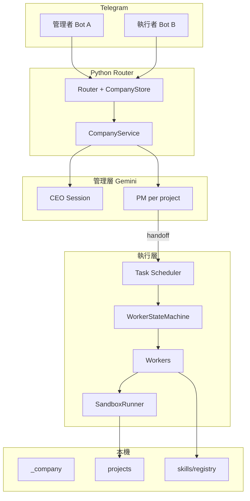

# AI 虛擬公司框架 — 設計規格

**日期**：2026-06-22  
**狀態**：已廢止 — 請使用 [`harness-design.md`](harness-design.md)  
**來源**：`AI虛擬公司(AI_Company_Framework)架構與實作說明書.docx` + 產品對齊討論  
**Repo**：AI-CEO（Python Router + Gemini + 雙 Telegram Bot）

---

## 1. 目標與非目標

### 1.1 目標

建立跑在 Mac 本機的「虛擬 AI 軟體公司」：**Python Router** 對上 **兩個 Telegram Bot**，對下 **Gemini 多角色** 與 **沙盒內檔案／終端工具**。開發者用 **Cursor** 開發此框架本身；**執行層 Worker 不遙控 IDE 內的 Cursor Agent**。

交付策略：**分階段完成**，優先序為：

1. **A** — 管理者 Bot：CEO/PM 對話、多專案建立／列出／切換  
2. **B** — 執行層狀態機輪流 Worker，產物在專案沙盒  
3. **Skill** — 角色可掛載 SKILL.md 套件（Git / find-skills / create-skill）  
4. **C** — 端到端自動化至 QA 通過  
5. **PM 運維** — 經任務排程者：中斷、維修、重啟等  

**COO／Token 報表**：第二階段。  
**MVP 介面**：僅 Telegram；網頁後續接入同一服務層。  
**Worker 產碼**：僅在沙盒內由 Gemini 生成與執行。

### 1.2 非目標（MVP / Phase A–B）

- 遙控 Cursor IDE Agent  
- 網頁 UI、COO 報表（預留資料欄位即可）  
- QA self-healing 全自動修復  
- 多專案並行執行 Worker（單一執行佇列）

---

## 2. 多專案與管理層（§1）

### 2.1 專案定義

一個**商業專案**包含：

1. 一個 **PM Gemini Chat Session**（專屬持久化）  
2. 沙盒內 **專案子目錄**（含 shared 與各 Worker 私有目錄）  
3. **metadata**（id、名稱、狀態、時間戳）

可多專案並存；**CEO 維持單一 Session**（不隨專案分裂）。

### 2.2 目錄結構

```text
company_workspace/
├── _company/
│   ├── projects.json           # 專案清單、active_project_id
│   ├── user_prefs.json         # tg_user_id → mode (ceo|pm)
│   ├── sessions/
│   │   ├── ceo.json
│   │   └── pm_<project_id>.json
│   ├── execution/
│   │   └── <project_id>.json   # 狀態機（Phase B）
│   └── metrics/
│       └── usage.jsonl         # COO 二期
└── projects/
    └── <project_id>/
        ├── shared/
        ├── backend_workspace/
        ├── frontend_workspace/
        ├── qa_workspace/
        └── pm_workspace/         # 看板、git meta、role_skills.yaml
```

公司級 Skill Registry（repo 內，非沙盒產物）：

```text
skills/registry/<skill-name>/SKILL.md
```

### 2.3 CEO / PM 行為

- **CEO**：建立專案、列出專案、切換 active、可寫入該專案 `shared/requirements.md` 草稿。  
- **PM**：每專案一 Session；使用者經管理者 Bot 對話時，依 **active_project_id** 路由。  
- **高風險 Git / skill 安裝核准**：TG Inline Keyboard；Git 在 PM 能力內；skill 自動安裝在 B+ 預設需核准（MVP skill 可先手動編輯 YAML）。

### 2.4 執行層與專案

- 狀態機路徑一律在 `projects/<project_id>/` 下解析。  
- **單一執行佇列**：同時只跑一個專案的狀態機；其他專案 handoff 時拒絕或排隊（MVP：**拒絕並提示**）。

### 2.5 Phase A 完成判定

- TG：CEO 建立第二專案 → `/projects` 可見 → `/switch` 後 PM 對話綁定不同專案。  
- 磁碟：兩套 `projects/<id>/` 存在且需求檔可分開。

---

## 3. Router、Session 與 Telegram（§2）

### 3.1 Router 職責

- 雙 Bot 分流（管理者 / 執行者）  
- 授權（`TELEGRAM_ALLOWED_USER_IDS`）  
- 讀寫 `projects.json`、`user_prefs.json`  
- 轉發訊息至 CEO 或 active 專案 PM Session  
- 執行結構化動作：建專案、切換、（後期）callback 核准  

現有雙 `Application` polling 保留；Phase A 疊加 **CompanyStore** + **Session 服務** + **意圖分派**。

### 3.2 Telegram 指令與模式

| 指令 | 行為 |
|------|------|
| `/start` | 說明 active 專案與指令 |
| `/projects` | 列出專案與 active 標記 |
| `/switch <project_id>` | 更新 active_project_id |
| `/ceo` | mode=ceo |
| `/pm` | mode=pm（需 active 專案） |
| `/newproject <名稱>` | 建專案樹、PM Session、metadata |

**對話模式**：非指令文字依 `user_prefs` 的 `mode` 送至 CEO 或 active PM。預設 **ceo**。

**自然語言**：CEO 可透過 tool 觸發建專案／切換（與指令共用服務）；MVP 驗收以指令路徑為準。

### 3.3 Session 持久化

- 檔案：`sessions/ceo.json`、`sessions/pm_<project_id>.json`  
- 欄位：`gemini_chat` 識別、時間戳、`project_id`（PM）、可選 `rolling_summary`  
- 重啟：依 json 還原 chat；失敗則標記 stale 並通知使用者  
- 建專案失敗：**回滾**（不留下半套目錄與索引）

### 3.4 執行者 Bot（Phase A）

- 不處理 CEO/PM 對話  
- `/start` + 可選唯讀狀態；Phase B 起接排程進度  

### 3.5 錯誤處理（Phase A 最小集）

- Gemini 逾時／429：回 TG 提示，不變更專案索引  
- 未授權 user：兩 Bot 皆拒絕  

---

## 4. 執行層、沙盒與 Skill（§3）

### 4.1 觸發

PM handoff（指令或 PM tool）→ **任務排程者** → `WorkerStateMachine`。Phase A 不啟動狀態機。

### 4.2 狀態機

狀態：`TASK_SCHEDULER` → `PLANNER`|`BACKEND`|`FRONTEND`|`QA` → 回 `TASK_SCHEDULER` → `PROJECT_DONE`（QA 失敗回 SCHEDULER）。

每輪：排程者輸出 `{ next_worker, task_desc, acceptance_criteria }` → 執行者 Bot 通知 → 喚醒單一 Worker → 回 SCHEDULER。

持久化：`execution/<project_id>.json`。重啟後預設 **回到 TASK_SCHEDULER 重新評估**（避免半套 task 卡住）。

### 4.3 沙盒 cwd

| Worker | 可寫 | 可讀 |
|--------|------|------|
| PLANNER | shared/ | shared/ |
| BACKEND | backend_workspace/, shared/ | + requirements |
| FRONTEND | frontend_workspace/, shared/ | 同上 |
| QA | qa_workspace/ | shared/ 含 builds、api_docs |
| TASK_SCHEDULER | pm_workspace/ 看板類 | shared/ 全讀；不跑 shell |

**SandboxRunner**：強制 cwd、禁止路徑逃逸、最小環境變數。

### 4.4 Skill Registry（方案 2）

- **Registry**：`skills/registry/<name>/SKILL.md`  
- **啟用**：`projects/<id>/pm_workspace/role_skills.yaml`  
- **來源**：Git、`npx skills add`（InstallService 落到 registry）、create-skill 流程  
- Worker 喚醒時合併啟用 skill 正文（注意 context 長度上限）  

安裝時機：晚於 B 核心；自動安裝預設 TG 核准。

### 4.5 PM 運維（C+）

`pause` | `resume` | `abort` | `restart_worker` — 經管理者 Bot 驗證；寫入 `execution/*.json`。

### 4.6 Phase B 完成判定

- 真實 Gemini 排程者 → 企劃至少一輪  
- `shared/` 或 `shared/builds/` 有可驗收產物  
- 全程 `project_id` 正確  

---

## 5. 橫切關注（§4）

### 5.1 階段表

| 階段 | 內容 |
|------|------|
| A | 管理層 TG + 多專案 |
| B | 狀態機 + Runner + 執行者通知 |
| B+ | Skill registry + 啟用 + 安裝 adapter |
| C | 端到端 QA 閉環 |
| C+ | PM 運維控制 |
| 產品二期 | COO metrics、網頁 API |

### 5.2 安全

TG 白名單與 callback 驗證；Git 限專案目錄；secrets 僅環境變數；skill 供應鏈需核准；日誌含 project_id / role / token 估算。

### 5.3 網頁預留

抽出 **CompanyService**（專案 CRUD、active、handoff、執行狀態），供 Telegram 與未來 HTTP API 共用。

### 5.4 COO 二期

append `metrics/usage.jsonl`；COO Session 僅報表，不進狀態機。

### 5.5 遷移

現有扁平 `company_workspace/*` → `projects/default/`；`ensure_workspace` 改為確保 `_company/` 與預設專案樹；提供一次性遷移步驟。

---

## 6. 架構圖



---

## 7. 測試策略（摘要）

- **Phase A**：指令建專案／切換；session 檔存在；重啟後對話恢復（API 允許範圍內）  
- **Phase B**：mock Gemini 狀態轉移；Runner 拒絕 cwd 逃逸；整合假 shared 檔案  
- **Skill**：YAML 啟用合併、registry 路徑解析  

---

## 8. 決策記錄

| 決策 | 選擇 |
|------|------|
| 專案模型 | 一專案 = PM Session + 沙盒子樹（A） |
| Skill 形態 | SKILL.md 套件 + registry（B） |
| Skill 安裝 | Git / find-skills / create-skill → registry |
| Cursor 與 Worker | 框架用 Cursor 開發；Worker 僅 Gemini + 沙盒 |
| 執行併發 | 單一 Worker 佇列 |
| 狀態機重啟 | 預設回 TASK_SCHEDULER |

---

## 9. 修訂紀錄

| 日期 | 說明 |
|------|------|
| 2026-06-22 | 初版：brainstorming §1–§4 合併 |
