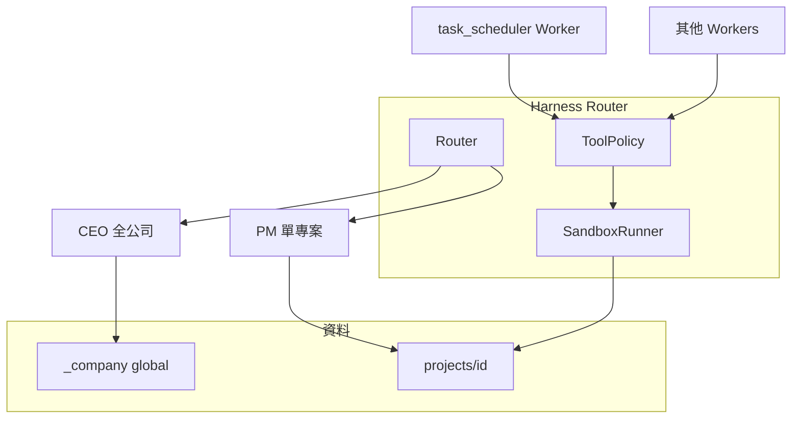

# AI 虛擬公司框架 — 修訂設計規格（Harness + 動態 Worker）

**日期**：2026-06-22（修訂）  
**狀態**：已核准（討論共識，2026-06-22）  
**取代**：[`framework-design-v1-archived.md`](framework-design-v1-archived.md)（初版，固定五目錄）  
**來源**：原規格書 + 產品對齊 + Harness Engineering 對照  

---

## 1. 定位：Harness，不是單一 Agent

本專案是 **多專案、多角色的 AI 駕馭層（Harness）**：Python Router 包覆 Gemini，透過 **沙盒、工具政策、編排、人機關卡與（後期）評估**，把模型行為收斂成可維運的軟體系統。執行層 **不** 遙控 Cursor IDE。

**Harness 五要素在本系統的落點**

| 要素 | 實作載體 |
|------|----------|
| 防護邊界 | Router 唯一入口；單執行佇列；CEO/PM 職責分離；TG 核准 |
| 環境裝配 | `projects/<id>/` 沙盒、Session、global/project/worker skill 疊加 |
| 工具治理 | `ToolPolicy` 依 Worker `kind` + 自訂 `SKILL.md` |
| 安全防護 | TG 白名單、cwd 沙盒、secrets 隔離、管理/執行 system 分離（二期可加輸出掃描） |
| 反饋與迭代 | 失敗 TG 決策 → 後期結構化評分 + COO metrics + QA 迴圈 |

參考：Anthropic [Building effective agents](https://www.anthropic.com/engineering/building-effective-agents)（routing、orchestrator–workers、evaluator–optimizer、沙盒測試）。

---

## 2. 目標、非目標與交付優先序

### 2.1 目標

- **CEO**：針對 **所有專案** 的全公司動作（切換 active、列表；`global_skills` / `global_config`）。  
- **PM**：針對 **單一專案** 的動作（Worker 編制、專案 skill、狀態、維修、Git；新增 Worker）。  
- **建專案（C）**：CEO **建殼**（id、目錄、PM Session、索引）→ PM **建局**（`workers.yaml`、各 Worker 目錄與 skill）。  
- **Worker**：每專案 **數量與種類可不同**（例：專案 a 五角色、專案 b 三角色）。  
- **MVP 介面**：僅 Telegram；網頁、COO 報表為二期。  

### 2.2 實作優先序（產品）

1. CEO：**切換專案** + 全公司設定／global skill  
2. PM：生成編制、專案 skill、**確認狀態**、**維修**、**Git**（含 TG 核准）  
3. 任務分配者 + 狀態機（在 PM 建局之後）  
4. Skill 生態（find-skills / create-skill；CEO 裝公司級、PM 啟用專案／角色級）  
5. 端到端 QA 閉環（C）  
6. COO／網頁  

### 2.3 非目標（近期）

- 遙控 Cursor Agent  
- 結構化 **AI 任務評分** 作為派工門檻（見 §7）  
- 多專案並行執行 Worker  
- QA 全自動 self-healing  

---

## 3. 治理模型：CEO 全公司 / PM 單專案

| 層級 | 範圍 | 範例 |
|------|------|------|
| **CEO** | 所有專案 | 安裝全專案共用的 registry skill；`global_config.yaml`（預設模型、通知政策） |
| **PM** | 一個 `project_id` | 安裝專案內全角色共用 skill；新增 Worker；Git；維修；查狀態 |

**Telegram**：管理者 Bot（A）承載 CEO + PM（依 `active_project_id` 與 user mode）。執行者 Bot（B）為 **通知通道**；排程邏輯在專案內 **任務分配者** Worker。

---

## 4. 工作區目錄（取代固定五目錄）

```text
company_workspace/
├── _company/
│   ├── projects.json
│   ├── user_prefs.json
│   ├── global_skills.yaml          # CEO：全專案啟用的 registry skill id
│   ├── global_config.yaml          # CEO：全專案預設
│   ├── sessions/
│   │   ├── ceo.json
│   │   └── pm_<project_id>.json
│   ├── execution/                  # 狀態機持久化（Phase B+）
│   └── metrics/usage.jsonl         # COO 二期
└── projects/
    ├── a/
    │   ├── shared/
    │   ├── pm/
    │   ├── project_skills.yaml     # PM：本專案全角色共用 skill
    │   ├── workers.yaml            # PM：編制表
    │   └── workers/
    │       ├── backend/
    │       ├── frontend/
    │       ├── planner/
    │       ├── scheduler/          # 任務分配者
    │       └── qa/
    └── b/
        ├── shared/
        ├── pm/
        ├── project_skills.yaml
        ├── workers.yaml
        └── workers/
            ├── backend/
            ├── planner/
            └── scheduler/
```

**遷移**：現有扁平 `company_workspace/shared` 等 **錯誤模型**；實作時遷至 `projects/default/` 或清空後依新結構建立。Repo 內 `skills/registry/` 仍為 skill 實體來源。

---

## 5. Worker 編制與模板（選項 B）

### 5.1 `workers.yaml`

每專案一份，PM 維護。每列一個 Worker **實例**：

```yaml
workers:
  - id: backend
    kind: backend
  - id: scheduler
    kind: task_scheduler
```

- **`id`**：目錄名 `workers/<id>/`，專案內唯一。  
- **`kind`**：內建枚舉或自訂（見下）。

### 5.2 內建 `kind`（枚舉）

| kind | 職責摘要 | 工具政策（預設） |
|------|----------|------------------|
| `planner` | 規格／企劃產物 | AI、讀寫 `shared/`、裝 skill/工具（依政策） |
| `backend` | 後端碼與 `api_docs` | AI、`backend/` + `shared/` |
| `frontend` | 前端與 builds | AI、`frontend/` + `shared/` |
| `qa` | 測試 | AI、`qa/` 寫入、讀 `shared/` |
| `task_scheduler` | 任務分配者 | AI、讀 `shared/` + `pm/`、**Git**、排程、失敗 **TG 詢問**（重試 / code review） |

### 5.3 自訂 kind（PM 新增 Worker 類型）

- 在 `workers/<id>/SKILL.md` 定義能力、流程、**允許工具列表**（供 `ToolPolicy` 解析）。  
- Router 註冊前 **校驗** SKILL 存在且工具集合為公司政策的子集。  
- 自訂 kind 名稱建議與 `id` 分離（例：`kind: custom_video_editor`）。

### 5.4 Skill 疊加順序

1. `skills/registry/` 中 CEO `global_skills.yaml` 啟用項  
2. `project_skills.yaml`  
3. `workers/<id>/role_skills.yaml`（可選）  
4. 自訂 kind 的 `SKILL.md` 正文（截斷規則實作時定義）

---

## 6. Router、Session、Telegram（摘要）

- **CEO 指令優先**：`/projects`、`/switch`、全公司設定；`/newproject` 建殼（可與 CEO 對話並存）。  
- **PM mode**：綁定 `active_project_id`；處理建局、狀態、維修、Git。  
- **Session 持久化**：`_company/sessions/`（與初版 spec 相同原則）。  
- **建專案失敗回滾**；Gemini 失敗不改 `projects.json`。

**框架程式（`src/ai_company`）**：通道 → `work_flow` 統一註冊 → 工具模組，見 [`src-layout.md`](src-layout.md)。

---

## 7. 任務分配、狀態機與反饋（Harness 反饋層）

### 7.1 第一版（決策 B）

- **不做**結構化評分作為派工前置條件。  
- 任務分配者依規則／LLM **排程**下一個 Worker；失敗時經 **TG** 請使用者選 **重試** 或 **code review 找問題**（human-in-the-loop）。  
- **可選 log**：`pm/scheduler_decisions.jsonl` 記錄派工與失敗原因，供日後評分模型使用。

### 7.2 後續

- 結構化 **AI 任務評分** 接入排程閘道。  
- QA evaluator–optimizer 迴圈與 COO `usage.jsonl`。

### 7.3 執行佇列

全公司 **單一** Worker 執行佇列；`project_id` 全程帶在 `execution/<id>.json` 與通知文案。

---

## 8. 安全與 ToolPolicy

- **SandboxRunner**：Worker subprocess 的 `cwd` 為 `projects/<id>/` 根（須存在 `workers/<id>/`）；Git 亦在專案根。路徑政策仍限專案沙盒內。  
- **Git**：預設僅 `task_scheduler`（及 PM 高風險操作經 TG 核准）。  
- **自動安裝工具/skill**：CEO 裝 registry；PM 啟用；高風險安裝 TG 核准（可分期：先手動 YAML）。  
- **Secrets**：僅環境變數，不寫入 `company_workspace`。

### 8.1 本機 Git（版本回滾）

- **工作區根**：`COMPANY_WORKSPACE_ROOT`（預設 `company_workspace/`），與框架 repo（`src/`）分離；勿在 repo 根另建 `_company/`。
- **專案**：每個 `projects/<id>/` 一個 Git 倉（PM `project_git`；cwd 為專案根）。
- **全公司設定**：`company_workspace/_company/` 可為獨立 Git 倉；**版本化** `projects.json`、`global_config.yaml`、`global_skills.yaml`、`user_prefs.json`；**不版本化** `sessions/`、`execution/`、`metrics/`（由 `init-workspace` 寫入 `.gitignore`）。

---

## 9. 架構圖



---

## 10. 測試與完成判定（修訂 Phase A/B）

**Phase A（CEO + PM 殼局）** — 簽收見 `docs/ROADMAP.md` §十三 模擬腳本

- [x] CEO `/switch` 於 a/b 間切換，PM Session 隔離  
- [x] CEO 寫入 `global_skills.yaml` / `global_config.yaml`  
- [x] PM 為專案 b 建立 3 Worker、專案 a 建立 5 Worker（`workers.yaml` + 目錄）  
- [x] 自訂 kind 需 `SKILL.md` 校驗失敗可拒絕  

**Phase B（Harness 執行）**

- [x] 任務分配者排程 + 執行者 Bot 通知  
- [x] 失敗 TG：重試 / code review 路徑  
- [x] `scheduler_decisions.jsonl` 有記錄（無結構化評分）  

---

## 11. 決策記錄

| 決策 | 選擇 |
|------|------|
| 建專案 | C：CEO 建殼，PM 建局 |
| Worker 模板 | B：枚舉 + 自訂 kind + `SKILL.md` |
| 目錄 | 每專案 `workers.yaml` + 動態 `workers/<id>/` |
| 任務評分 | B：先排程 + TG 人選，評分後加 |
| Harness | 五要素映射至 Router／沙盒／ToolPolicy／日誌 |

---

## 12. 修訂紀錄

| 日期 | 說明 |
|------|------|
| 2026-06-22 | 初版 spec |
| 2026-06-22 | 本修訂：動態 Worker、CEO/PM 治理、Harness、評分 B |
